# OwnaFarm Smart Contracts

> Mantle Sepolia Testnet | Chain ID: 5003

## Contract Addresses

| Contract | Address | Explorer |
|----------|---------|----------|
| GoldToken | `0x787c8616d9b8Ccdca3B2b930183813828291dA9c` | [View](https://sepolia.mantlescan.xyz/address/0x787c8616d9b8Ccdca3B2b930183813828291dA9c) |
| GoldFaucet | `0x5644F393a2480BE5E63731C30fCa81F9e80277a7` | [View](https://sepolia.mantlescan.xyz/address/0x5644F393a2480BE5E63731C30fCa81F9e80277a7) |
| OwnaFarmNFT | `0xC51601dde25775bA2740EE14D633FA54e12Ef6C7` | [View](https://sepolia.mantlescan.xyz/address/0xC51601dde25775bA2740EE14D633FA54e12Ef6C7) |
| OwnaFarmVault | `0x3b561Df673F08A566A09fEd718f5bdB8018C2CDa` | [View](https://sepolia.mantlescan.xyz/address/0x3b561Df673F08A566A09fEd718f5bdB8018C2CDa) |

---

## Invoice Flow

```mermaid
sequenceDiagram
    participant F as 👨‍🌾 Petani
    participant SC as ⛓️ OwnaFarmNFT
    participant A as 👨‍💼 Admin
    participant I as 💰 Investor

    F->>SC: submitInvoice()
    Note right of SC: Status: PENDING

    A->>SC: getPendingInvoices()
    SC-->>A: [pending invoices]
    
    A->>SC: approveInvoice()
    Note right of SC: Status: APPROVED

    I->>SC: getAvailableInvoices()
    SC-->>I: [available invoices]
    
    I->>SC: invest(tokenId, amount)
    Note right of SC: Status: FUNDED (if full)
    
    Note over I,SC: After maturity period...
    
    I->>SC: harvest(investmentId)
    SC-->>I: Principal + Yield
```




---

## Functions Reference

### GoldToken (ERC20)

| Function | Access | Description |
|----------|--------|-------------|
| `balanceOf(address)` | Public | Get GOLD balance |
| `approve(spender, amount)` | Public | Approve spender |
| `transfer(to, amount)` | Public | Transfer GOLD |
| `mint(to, amount)` | Owner | Mint new GOLD |

### GoldFaucet

| Function | Access | Description |
|----------|--------|-------------|
| `claim()` | Public | Claim 10,000 GOLD (24h cooldown) |
| `canClaim(address)` | View | Check if can claim |
| `timeUntilNextClaim(address)` | View | Seconds until next claim |
| `deposit(amount)` | Public | Deposit GOLD to faucet |
| `setClaimAmount(amount)` | Admin | Set claim amount |
| `setCooldownTime(seconds)` | Admin | Set cooldown time |
| `withdraw(amount)` | Admin | Withdraw GOLD |

### OwnaFarmNFT

| Function | Access | Description |
|----------|--------|-------------|
| `submitInvoice(offtakerId, target, yieldBps, duration)` | **Public** | Submit invoice for review |
| `approveInvoice(tokenId)` | Admin | Approve pending invoice |
| `rejectInvoice(tokenId)` | Admin | Reject pending invoice |
| `invest(tokenId, amount)` | Public | Invest GOLD to approved invoice |
| `harvest(investmentId)` | Public | Claim principal + yield |
| `getPendingInvoices(offset, limit)` | View | List pending invoices |
| `getPendingCount()` | View | Count pending invoices |
| `getAvailableInvoices(offset, limit)` | View | List available invoices |
| `getAvailableCount()` | View | Count available invoices |
| `getInvestment(investor, id)` | View | Get investment details |
| `investmentCount(address)` | View | Count investments |

### OwnaFarmVault

| Function | Access | Description |
|----------|--------|-------------|
| `setFarmNFT(address)` | Admin | Set FarmNFT address (once) |
| `depositYield(amount)` | Admin | Deposit yield reserve |
| `withdrawYield(to, amount)` | FarmNFT | Withdraw yield to investor |
| `emergencyWithdraw(token, amount)` | SuperAdmin | Emergency withdraw |

---

## Setup & Deploy

```bash
forge install
forge build
forge test -vv

cp .env.example .env
# Edit .env with PRIVATE_KEY

source .env
forge script script/Deploy.s.sol:DeployOwnaFarm --rpc-url $RPC_URL --broadcast --verify
```

---

**Built by YeheskielTame (OwnaFarm Team Lead)**
